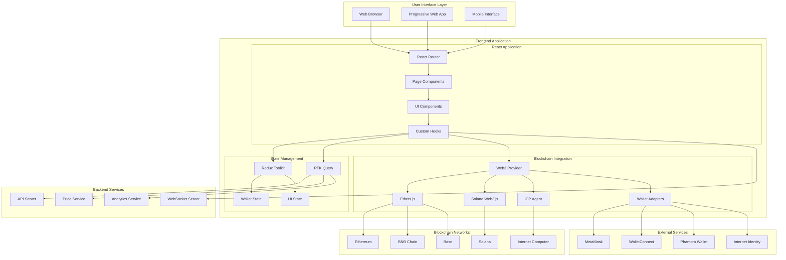

# Design Document

## Overview

The BTCMiner Advanced Frontend is a sophisticated React-based web application that serves as the primary user interface for the BTCMiner omnichain ecosystem. The application provides a unified experience for managing cross-chain tokens, monitoring prices, managing liquidity, and interacting with digital identity services across Ethereum, BNB Chain, Base, Solana, and ICP networks.

## Architecture

### High-Level Frontend Architecture



### Technology Stack

| Layer | Technology | Purpose |
|-------|------------|---------|
| **Frontend Framework** | React 18 + TypeScript | Core application framework |
| **State Management** | Redux Toolkit + RTK Query | Global state and API management |
| **Routing** | React Router v6 | Client-side routing |
| **Styling** | TailwindCSS + Headless UI | Responsive design system |
| **Blockchain Integration** | Ethers.js v6, @solana/web3.js, @dfinity/agent | Multi-chain connectivity |
| **Wallet Integration** | WalletConnect v2, @solana/wallet-adapter | Multi-wallet support |
| **Charts & Visualization** | Recharts, D3.js | Data visualization |
| **Animations** | Framer Motion | Smooth animations |
| **Build Tool** | Vite | Fast development and building |
| **Testing** | Vitest, React Testing Library | Unit and integration testing |

## Components and Interfaces

### 1. Application Structure

```
src/
├── components/           # Reusable UI components
│   ├── common/          # Generic components
│   ├── layout/          # Layout components
│   ├── wallet/          # Wallet-related components
│   ├── bridge/          # Cross-chain bridge components
│   ├── identity/        # Identity management components
│   ├── price/           # Price monitoring components
│   ├── liquidity/       # Liquidity management components
│   ├── trading/         # Trading interface components
│   └── analytics/       # Analytics and reporting components
├── pages/               # Page components
├── hooks/               # Custom React hooks
├── store/               # Redux store configuration
├── services/            # API and blockchain services
├── utils/               # Utility functions
├── types/               # TypeScript type definitions
├── constants/           # Application constants
└── assets/              # Static assets
```

### 2. Core Components Architecture

#### Layout Components

```typescript
// Layout/Header.tsx
interface HeaderProps {
  user?: User;
  wallets: ConnectedWallet[];
  onWalletConnect: () => void;
  onWalletDisconnect: (walletId: string) => void;
}

export const Header: React.FC<HeaderProps> = ({
  user,
  wallets,
  onWalletConnect,
  onWalletDisconnect
}) => {
  return (
    <header className="bg-white shadow-sm border-b">
      <div className="max-w-7xl mx-auto px-4 sm:px-6 lg:px-8">
        <div className="flex justify-between items-center h-16">
          <Logo />
          <Navigation />
          <div className="flex items-center space-x-4">
            <NetworkSelector />
            <WalletConnector 
              wallets={wallets}
              onConnect={onWalletConnect}
              onDisconnect={onWalletDisconnect}
            />
            <UserMenu user={user} />
          </div>
        </div>
      </div>
    </header>
  );
};
```

#### Dashboard Components

```typescript
// Dashboard/DashboardOverview.tsx
interface DashboardOverviewProps {
  portfolioData: PortfolioData;
  priceData: PriceData[];
  liquidityData: LiquidityData[];
  recentTransactions: Transaction[];
}

export const DashboardOverview: React.FC<DashboardOverviewProps> = ({
  portfolioData,
  priceData,
  liquidityData,
  recentTransactions
}) => {
  return (
    <div className="space-y-6">
      <PortfolioSummary data={portfolioData} />
      <div className="grid grid-cols-1 lg:grid-cols-2 gap-6">
        <PriceChart data={priceData} />
        <LiquidityOverview data={liquidityData} />
      </div>
      <RecentTransactions transactions={recentTransactions} />
    </div>
  );
};

// Dashboard/PortfolioSummary.tsx
interface PortfolioSummaryProps {
  data: PortfolioData;
}

export const PortfolioSummary: React.FC<PortfolioSummaryProps> = ({ data }) => {
  return (
    <div className="bg-white rounded-lg shadow p-6">
      <h2 className="text-lg font-medium text-gray-900 mb-4">Portfolio Overview</h2>
      <div className="grid grid-cols-1 md:grid-cols-4 gap-4">
        <StatCard
          title="Total Value"
          value={`$${data.totalValue.toLocaleString()}`}
          change={data.totalValueChange}
          changeType={data.totalValueChange >= 0 ? 'positive' : 'negative'}
        />
        <StatCard
          title="BTCMiner Balance"
          value={`${data.totalTokens.toLocaleString()} BTM`}
          change={data.tokenChange}
          changeType={data.tokenChange >= 0 ? 'positive' : 'negative'}
        />
        <StatCard
          title="Active Chains"
          value={data.activeChains.toString()}
          subtitle={`${data.connectedWallets} wallets connected`}
        />
        <StatCard
          title="Liquidity Positions"
          value={`$${data.liquidityValue.toLocaleString()}`}
          subtitle={`${data.liquidityPositions} positions`}
        />
      </div>
    </div>
  );
};
```

#### Wallet Integration Components

```typescript
// Wallet/WalletConnector.tsx
interface WalletConnectorProps {
  wallets: ConnectedWallet[];
  onConnect: () => void;
  onDisconnect: (walletId: string) => void;
}

export const WalletConnector: React.FC<WalletConnectorProps> = ({
  wallets,
  onConnect,
  onDisconnect
}) => {
  const [isOpen, setIsOpen] = useState(false);
  
  return (
    <>
      <button
        onClick={() => setIsOpen(true)}
        className="bg-blue-600 text-white px-4 py-2 rounded-md hover:bg-blue-700"
      >
        {wallets.length > 0 ? `${wallets.length} Wallets` : 'Connect Wallet'}
      </button>
      
      <WalletModal
        isOpen={isOpen}
        onClose={() => setIsOpen(false)}
        connectedWallets={wallets}
        onConnect={onConnect}
        onDisconnect={onDisconnect}
      />
    </>
  );
};

// Wallet/WalletModal.tsx
export const WalletModal: React.FC<WalletModalProps> = ({
  isOpen,
  onClose,
  connectedWallets,
  onConnect,
  onDisconnect
}) => {
  const availableWallets = [
    { id: 'metamask', name: 'MetaMask', icon: MetaMaskIcon, chains: ['ethereum', 'bnb', 'base'] },
    { id: 'walletconnect', name: 'WalletConnect', icon: WalletConnectIcon, chains: ['ethereum', 'bnb', 'base'] },
    { id: 'phantom', name: 'Phantom', icon: PhantomIcon, chains: ['solana'] },
    { id: 'internet-identity', name: 'Internet Identity', icon: ICPIcon, chains: ['icp'] }
  ];
  
  return (
    <Dialog open={isOpen} onClose={onClose}>
      <div className="fixed inset-0 bg-black bg-opacity-25" />
      <div className="fixed inset-0 overflow-y-auto">
        <div className="flex min-h-full items-center justify-center p-4">
          <Dialog.Panel className="w-full max-w-md bg-white rounded-lg p-6">
            <Dialog.Title className="text-lg font-medium mb-4">
              Connect Wallets
            </Dialog.Title>
            
            <div className="space-y-3">
              {availableWallets.map((wallet) => (
                <WalletOption
                  key={wallet.id}
                  wallet={wallet}
                  isConnected={connectedWallets.some(w => w.type === wallet.id)}
                  onConnect={() => handleWalletConnect(wallet.id)}
                  onDisconnect={() => handleWalletDisconnect(wallet.id)}
                />
              ))}
            </div>
          </Dialog.Panel>
        </div>
      </div>
    </Dialog>
  );
};
```

#### Cross-Chain Bridge Components

```typescript
// Bridge/BridgeInterface.tsx
interface BridgeInterfaceProps {
  supportedChains: Chain[];
  userBalances: Record<string, string>;
}

export const BridgeInterface: React.FC<BridgeInterfaceProps> = ({
  supportedChains,
  userBalances
}) => {
  const [fromChain, setFromChain] = useState<Chain>();
  const [toChain, setToChain] = useState<Chain>();
  const [amount, setAmount] = useState('');
  const [isTransferring, setIsTransferring] = useState(false);
  
  const { data: transferFee } = useTransferFeeQuery({
    fromChain: fromChain?.id,
    toChain: toChain?.id,
    amount
  });
  
  const handleTransfer = async () => {
    if (!fromChain || !toChain || !amount) return;
    
    setIsTransferring(true);
    try {
      await initiateCrossChainTransfer({
        fromChain: fromChain.id,
        toChain: toChain.id,
        amount,
        recipient: userAddress
      });
    } catch (error) {
      console.error('Transfer failed:', error);
    } finally {
      setIsTransferring(false);
    }
  };
  
  return (
    <div className="bg-white rounded-lg shadow p-6">
      <h2 className="text-lg font-medium mb-6">Cross-Chain Bridge</h2>
      
      <div className="space-y-4">
        <ChainSelector
          label="From"
          chains={supportedChains}
          selectedChain={fromChain}
          onSelect={setFromChain}
          balance={fromChain ? userBalances[fromChain.id] : undefined}
        />
        
        <div className="flex justify-center">
          <button
            onClick={() => {
              const temp = fromChain;
              setFromChain(toChain);
              setToChain(temp);
            }}
            className="p-2 rounded-full bg-gray-100 hover:bg-gray-200"
          >
            <ArrowUpDownIcon className="w-5 h-5" />
          </button>
        </div>
        
        <ChainSelector
          label="To"
          chains={supportedChains.filter(c => c.id !== fromChain?.id)}
          selectedChain={toChain}
          onSelect={setToChain}
        />
        
        <AmountInput
          value={amount}
          onChange={setAmount}
          maxAmount={fromChain ? userBalances[fromChain.id] : '0'}
          token="BTM"
        />
        
        {transferFee && (
          <TransferSummary
            amount={amount}
            fromChain={fromChain?.name}
            toChain={toChain?.name}
            fee={transferFee.fee}
            estimatedTime={transferFee.estimatedTime}
          />
        )}
        
        <button
          onClick={handleTransfer}
          disabled={!fromChain || !toChain || !amount || isTransferring}
          className="w-full bg-blue-600 text-white py-3 rounded-md hover:bg-blue-700 disabled:opacity-50"
        >
          {isTransferring ? 'Transferring...' : 'Transfer'}
        </button>
      </div>
    </div>
  );
};
```

#### Price Monitoring Components

```typescript
// Price/PriceChart.tsx
interface PriceChartProps {
  data: PriceData[];
  timeframe: '1H' | '24H' | '7D' | '30D' | '1Y';
  onTimeframeChange: (timeframe: string) => void;
}

export const PriceChart: React.FC<PriceChartProps> = ({
  data,
  timeframe,
  onTimeframeChange
}) => {
  return (
    <div className="bg-white rounded-lg shadow p-6">
      <div className="flex justify-between items-center mb-4">
        <h3 className="text-lg font-medium">BTCMiner Price</h3>
        <TimeframeSelector
          selected={timeframe}
          options={['1H', '24H', '7D', '30D', '1Y']}
          onChange={onTimeframeChange}
        />
      </div>
      
      <div className="h-64">
        <ResponsiveContainer width="100%" height="100%">
          <LineChart data={data}>
            <CartesianGrid strokeDasharray="3 3" />
            <XAxis dataKey="timestamp" />
            <YAxis />
            <Tooltip />
            <Line
              type="monotone"
              dataKey="price"
              stroke="#2563eb"
              strokeWidth={2}
              dot={false}
            />
          </LineChart>
        </ResponsiveContainer>
      </div>
      
      <PriceStats data={data} />
    </div>
  );
};

// Price/PriceAlerts.tsx
export const PriceAlerts: React.FC = () => {
  const [alerts, setAlerts] = useState<PriceAlert[]>([]);
  const [newAlert, setNewAlert] = useState<Partial<PriceAlert>>({});
  
  return (
    <div className="bg-white rounded-lg shadow p-6">
      <h3 className="text-lg font-medium mb-4">Price Alerts</h3>
      
      <div className="space-y-4">
        <AlertForm
          alert={newAlert}
          onChange={setNewAlert}
          onSubmit={handleCreateAlert}
        />
        
        <div className="space-y-2">
          {alerts.map((alert) => (
            <AlertItem
              key={alert.id}
              alert={alert}
              onDelete={handleDeleteAlert}
              onToggle={handleToggleAlert}
            />
          ))}
        </div>
      </div>
    </div>
  );
};
```

### 3. State Management Architecture

#### Redux Store Structure

```typescript
// store/index.ts
export interface RootState {
  wallet: WalletState;
  portfolio: PortfolioState;
  bridge: BridgeState;
  price: PriceState;
  liquidity: LiquidityState;
  identity: IdentityState;
  ui: UIState;
}

// store/slices/walletSlice.ts
interface WalletState {
  connectedWallets: ConnectedWallet[];
  balances: Record<string, Record<string, string>>;
  isConnecting: boolean;
  error: string | null;
}

const walletSlice = createSlice({
  name: 'wallet',
  initialState,
  reducers: {
    connectWalletStart: (state) => {
      state.isConnecting = true;
      state.error = null;
    },
    connectWalletSuccess: (state, action) => {
      state.connectedWallets.push(action.payload);
      state.isConnecting = false;
    },
    connectWalletFailure: (state, action) => {
      state.error = action.payload;
      state.isConnecting = false;
    },
    updateBalances: (state, action) => {
      state.balances = { ...state.balances, ...action.payload };
    },
    disconnectWallet: (state, action) => {
      state.connectedWallets = state.connectedWallets.filter(
        w => w.id !== action.payload
      );
    }
  }
});
```

#### API Integration with RTK Query

```typescript
// services/api.ts
export const btcMinerApi = createApi({
  reducerPath: 'btcMinerApi',
  baseQuery: fetchBaseQuery({
    baseUrl: '/api',
    prepareHeaders: (headers, { getState }) => {
      const token = (getState() as RootState).auth.token;
      if (token) {
        headers.set('authorization', `Bearer ${token}`);
      }
      return headers;
    },
  }),
  tagTypes: ['Portfolio', 'Prices', 'Transactions', 'Liquidity'],
  endpoints: (builder) => ({
    getPortfolio: builder.query<PortfolioData, string>({
      query: (userId) => `portfolio/${userId}`,
      providesTags: ['Portfolio'],
    }),
    getPrices: builder.query<PriceData[], { timeframe: string }>({
      query: ({ timeframe }) => `prices?timeframe=${timeframe}`,
      providesTags: ['Prices'],
    }),
    getTransactions: builder.query<Transaction[], { userId: string; page: number }>({
      query: ({ userId, page }) => `transactions/${userId}?page=${page}`,
      providesTags: ['Transactions'],
    }),
    initiateCrossChainTransfer: builder.mutation<TransferResult, TransferRequest>({
      query: (transfer) => ({
        url: 'bridge/transfer',
        method: 'POST',
        body: transfer,
      }),
      invalidatesTags: ['Portfolio', 'Transactions'],
    }),
  }),
});
```

### 4. Custom Hooks Architecture

```typescript
// hooks/useWalletConnection.ts
export const useWalletConnection = () => {
  const dispatch = useAppDispatch();
  const { connectedWallets, isConnecting } = useAppSelector(state => state.wallet);
  
  const connectWallet = useCallback(async (walletType: WalletType) => {
    dispatch(connectWalletStart());
    
    try {
      let wallet: ConnectedWallet;
      
      switch (walletType) {
        case 'metamask':
          wallet = await connectMetaMask();
          break;
        case 'phantom':
          wallet = await connectPhantom();
          break;
        case 'internet-identity':
          wallet = await connectInternetIdentity();
          break;
        default:
          throw new Error(`Unsupported wallet type: ${walletType}`);
      }
      
      dispatch(connectWalletSuccess(wallet));
    } catch (error) {
      dispatch(connectWalletFailure(error.message));
    }
  }, [dispatch]);
  
  const disconnectWallet = useCallback((walletId: string) => {
    dispatch(disconnectWallet(walletId));
  }, [dispatch]);
  
  return {
    connectedWallets,
    isConnecting,
    connectWallet,
    disconnectWallet
  };
};

// hooks/useCrossChainTransfer.ts
export const useCrossChainTransfer = () => {
  const [initiateCrossChainTransfer] = useInitiateCrossChainTransferMutation();
  
  const transfer = useCallback(async (params: TransferParams) => {
    try {
      const result = await initiateCrossChainTransfer(params).unwrap();
      
      // Track transfer status
      trackTransferStatus(result.transactionId);
      
      return result;
    } catch (error) {
      throw new Error(`Transfer failed: ${error.message}`);
    }
  }, [initiateCrossChainTransfer]);
  
  return { transfer };
};

// hooks/useRealTimePrice.ts
export const useRealTimePrice = (symbol: string) => {
  const [price, setPrice] = useState<number | null>(null);
  const [change24h, setChange24h] = useState<number>(0);
  
  useEffect(() => {
    const ws = new WebSocket(`${WS_URL}/prices/${symbol}`);
    
    ws.onmessage = (event) => {
      const data = JSON.parse(event.data);
      setPrice(data.price);
      setChange24h(data.change24h);
    };
    
    return () => ws.close();
  }, [symbol]);
  
  return { price, change24h };
};
```

## Data Models

### 1. Wallet and Account Models

```typescript
interface ConnectedWallet {
  id: string;
  type: 'metamask' | 'walletconnect' | 'phantom' | 'internet-identity';
  address: string;
  chainId: number;
  chainName: string;
  balance: string;
  isActive: boolean;
  connectedAt: Date;
}

interface User {
  id: string;
  internetIdentityPrincipal?: string;
  connectedWallets: ConnectedWallet[];
  preferences: UserPreferences;
  createdAt: Date;
  lastActiveAt: Date;
}

interface UserPreferences {
  defaultChain: string;
  currency: 'USD' | 'EUR' | 'BTC' | 'ETH';
  notifications: NotificationSettings;
  privacy: PrivacySettings;
}
```

### 2. Portfolio and Transaction Models

```typescript
interface PortfolioData {
  totalValue: number;
  totalValueChange: number;
  totalTokens: number;
  tokenChange: number;
  activeChains: number;
  connectedWallets: number;
  liquidityValue: number;
  liquidityPositions: number;
  chainBalances: Record<string, ChainBalance>;
}

interface ChainBalance {
  chainId: number;
  chainName: string;
  balance: string;
  usdValue: number;
  percentage: number;
}

interface Transaction {
  id: string;
  type: 'transfer' | 'bridge' | 'swap' | 'liquidity';
  status: 'pending' | 'processing' | 'completed' | 'failed';
  fromChain: string;
  toChain?: string;
  amount: string;
  token: string;
  hash: string;
  gasUsed?: string;
  fee: string;
  timestamp: Date;
  estimatedTime?: number;
}
```

### 3. Price and Market Data Models

```typescript
interface PriceData {
  timestamp: Date;
  price: number;
  volume24h: number;
  marketCap: number;
  change1h: number;
  change24h: number;
  change7d: number;
}

interface PriceAlert {
  id: string;
  userId: string;
  symbol: string;
  condition: 'above' | 'below' | 'change';
  targetPrice?: number;
  changePercentage?: number;
  isActive: boolean;
  createdAt: Date;
  triggeredAt?: Date;
}

interface ChainPriceData {
  chainId: number;
  chainName: string;
  price: number;
  deviation: number;
  lastUpdate: Date;
  source: string;
}
```

### 4. Liquidity and DeFi Models

```typescript
interface LiquidityPosition {
  id: string;
  chainId: number;
  poolAddress: string;
  tokenA: string;
  tokenB: string;
  liquidity: string;
  share: number;
  apy: number;
  rewards: string;
  impermanentLoss: number;
  createdAt: Date;
}

interface LiquidityPool {
  chainId: number;
  address: string;
  totalLiquidity: string;
  availableLiquidity: string;
  utilizationRate: number;
  apy: number;
  healthScore: number;
  warningLevel: 'normal' | 'low' | 'critical';
  lastRebalance: Date;
}
```

## Error Handling

### 1. Frontend Error Boundaries

```typescript
// components/ErrorBoundary.tsx
interface ErrorBoundaryState {
  hasError: boolean;
  error?: Error;
  errorInfo?: ErrorInfo;
}

export class ErrorBoundary extends Component<
  PropsWithChildren<{}>,
  ErrorBoundaryState
> {
  constructor(props: PropsWithChildren<{}>) {
    super(props);
    this.state = { hasError: false };
  }
  
  static getDerivedStateFromError(error: Error): ErrorBoundaryState {
    return { hasError: true, error };
  }
  
  componentDidCatch(error: Error, errorInfo: ErrorInfo) {
    console.error('Error caught by boundary:', error, errorInfo);
    
    // Log to error reporting service
    logErrorToService(error, errorInfo);
  }
  
  render() {
    if (this.state.hasError) {
      return (
        <div className="min-h-screen flex items-center justify-center">
          <div className="text-center">
            <h1 className="text-2xl font-bold text-gray-900 mb-4">
              Something went wrong
            </h1>
            <p className="text-gray-600 mb-4">
              We're sorry, but something unexpected happened.
            </p>
            <button
              onClick={() => window.location.reload()}
              className="bg-blue-600 text-white px-4 py-2 rounded-md hover:bg-blue-700"
            >
              Reload Page
            </button>
          </div>
        </div>
      );
    }
    
    return this.props.children;
  }
}
```

### 2. Wallet Connection Error Handling

```typescript
// utils/walletErrors.ts
export class WalletError extends Error {
  constructor(
    message: string,
    public code: string,
    public walletType: string
  ) {
    super(message);
    this.name = 'WalletError';
  }
}

export const handleWalletError = (error: any, walletType: string): WalletError => {
  if (error.code === 4001) {
    return new WalletError('User rejected the request', 'USER_REJECTED', walletType);
  }
  
  if (error.code === -32002) {
    return new WalletError('Request already pending', 'REQUEST_PENDING', walletType);
  }
  
  if (error.message?.includes('No Ethereum provider')) {
    return new WalletError('Wallet not installed', 'WALLET_NOT_INSTALLED', walletType);
  }
  
  return new WalletError(
    error.message || 'Unknown wallet error',
    'UNKNOWN_ERROR',
    walletType
  );
};
```

### 3. Transaction Error Handling

```typescript
// utils/transactionErrors.ts
export const handleTransactionError = (error: any): string => {
  if (error.code === 'INSUFFICIENT_FUNDS') {
    return 'Insufficient funds for this transaction';
  }
  
  if (error.code === 'NETWORK_ERROR') {
    return 'Network error. Please check your connection and try again';
  }
  
  if (error.code === 'USER_REJECTED') {
    return 'Transaction was rejected by user';
  }
  
  if (error.message?.includes('gas')) {
    return 'Transaction failed due to gas issues. Try increasing gas limit';
  }
  
  return error.message || 'Transaction failed. Please try again';
};
```

## Testing Strategy

### 1. Component Testing

```typescript
// __tests__/components/WalletConnector.test.tsx
describe('WalletConnector', () => {
  it('should display connect button when no wallets connected', () => {
    render(
      <WalletConnector
        wallets={[]}
        onConnect={jest.fn()}
        onDisconnect={jest.fn()}
      />
    );
    
    expect(screen.getByText('Connect Wallet')).toBeInTheDocument();
  });
  
  it('should display wallet count when wallets connected', () => {
    const mockWallets = [
      { id: '1', type: 'metamask', address: '0x123...', chainId: 1 },
      { id: '2', type: 'phantom', address: 'ABC123...', chainId: 101 }
    ];
    
    render(
      <WalletConnector
        wallets={mockWallets}
        onConnect={jest.fn()}
        onDisconnect={jest.fn()}
      />
    );
    
    expect(screen.getByText('2 Wallets')).toBeInTheDocument();
  });
  
  it('should call onConnect when connect button clicked', () => {
    const mockOnConnect = jest.fn();
    
    render(
      <WalletConnector
        wallets={[]}
        onConnect={mockOnConnect}
        onDisconnect={jest.fn()}
      />
    );
    
    fireEvent.click(screen.getByText('Connect Wallet'));
    expect(mockOnConnect).toHaveBeenCalled();
  });
});
```

### 2. Hook Testing

```typescript
// __tests__/hooks/useWalletConnection.test.ts
describe('useWalletConnection', () => {
  it('should connect MetaMask wallet successfully', async () => {
    const { result } = renderHook(() => useWalletConnection(), {
      wrapper: ({ children }) => (
        <Provider store={mockStore}>{children}</Provider>
      )
    });
    
    // Mock MetaMask connection
    (window as any).ethereum = {
      request: jest.fn().mockResolvedValue(['0x123...'])
    };
    
    await act(async () => {
      await result.current.connectWallet('metamask');
    });
    
    expect(result.current.connectedWallets).toHaveLength(1);
    expect(result.current.connectedWallets[0].type).toBe('metamask');
  });
  
  it('should handle wallet connection errors', async () => {
    const { result } = renderHook(() => useWalletConnection(), {
      wrapper: ({ children }) => (
        <Provider store={mockStore}>{children}</Provider>
      )
    });
    
    // Mock MetaMask rejection
    (window as any).ethereum = {
      request: jest.fn().mockRejectedValue({ code: 4001 })
    };
    
    await act(async () => {
      try {
        await result.current.connectWallet('metamask');
      } catch (error) {
        expect(error.code).toBe('USER_REJECTED');
      }
    });
  });
});
```

### 3. Integration Testing

```typescript
// __tests__/integration/CrossChainBridge.test.tsx
describe('Cross-Chain Bridge Integration', () => {
  it('should complete full bridge flow', async () => {
    const mockTransfer = jest.fn().mockResolvedValue({
      transactionId: 'tx123',
      status: 'pending'
    });
    
    render(
      <Provider store={mockStore}>
        <BridgeInterface
          supportedChains={mockChains}
          userBalances={mockBalances}
        />
      </Provider>
    );
    
    // Select source chain
    fireEvent.click(screen.getByText('Ethereum'));
    
    // Select destination chain
    fireEvent.click(screen.getByText('BNB Chain'));
    
    // Enter amount
    fireEvent.change(screen.getByPlaceholderText('Amount'), {
      target: { value: '100' }
    });
    
    // Submit transfer
    fireEvent.click(screen.getByText('Transfer'));
    
    await waitFor(() => {
      expect(mockTransfer).toHaveBeenCalledWith({
        fromChain: 1,
        toChain: 56,
        amount: '100',
        recipient: expect.any(String)
      });
    });
  });
});
```

This comprehensive design provides a robust foundation for the BTCMiner Advanced Frontend, ensuring scalability, maintainability, and excellent user experience across all supported blockchain networks.