# Design Document

## Overview

The BTCMiner LayerZero OFT system is designed as a sophisticated omnichain token infrastructure that enables seamless cross-chain operations with dynamic burn-to-mint mechanisms. The architecture leverages LayerZero's messaging protocol to create a unified token experience across multiple blockchain networks while maintaining security, liquidity, and price synchronization.

## Architecture

### High-Level System Architecture

```mermaid
graph TB
    subgraph "Frontend Layer"
        UI[React Dashboard]
        WS[WebSocket Client]
        WALLET[Multi-Chain Wallet Support]
        II_AUTH[Internet Identity Auth]
    end
    
    subgraph "ICP Layer"
        subgraph "Internet Computer"
            II_CANISTER[Internet Identity Canister]
            PRICE_CANISTER[Price Monitoring Canister]
            IDENTITY_CANISTER[Digital Identity Canister]
            LIQUIDITY_CANISTER[Liquidity Health Canister]
        end
    end
    
    subgraph "Backend Coordination Layer"
        API[Node.js API Server]
        QUEUE[Redis Queue System]
        DB[(PostgreSQL)]
        CACHE[(Redis Cache)]
        BRIDGE[Cross-Chain Bridge Coordinator]
        ICP_AGENT[ICP Agent Service]
    end
    
    subgraph "EVM Blockchain Layer"
        subgraph "Ethereum"
            ETH_OFT[BTCMiner OFT]
            ETH_ROUTER[Cross-Chain Router]
            ETH_ORACLE[Price Oracle]
            ETH_WORMHOLE[Wormhole Bridge]
        end
        
        subgraph "BNB Chain"
            BNB_OFT[BTCMiner OFT]
            BNB_ROUTER[Cross-Chain Router]
            BNB_ORACLE[Price Oracle]
            BNB_WORMHOLE[Wormhole Bridge]
        end
        
        subgraph "Base"
            BASE_OFT[BTCMiner OFT]
            BASE_ROUTER[Cross-Chain Router]
            BASE_ORACLE[Price Oracle]
            BASE_WORMHOLE[Wormhole Bridge]
        end
    end
    
    subgraph "Solana Blockchain Layer"
        subgraph "Solana"
            SOL_TOKEN[BTCMiner SPL Token]
            SOL_PROGRAM[Cross-Chain Program]
            SOL_ORACLE[Pyth Oracle]
            SOL_WORMHOLE[Wormhole Bridge]
        end
    end
    
    subgraph "External Services"
        LZ[LayerZero Endpoints]
        WORMHOLE[Wormhole Network]
        CHAINLINK[Chainlink Oracles]
        PYTH[Pyth Network]
        LIFI[LI.FI Protocol]
        RAYDIUM[Raydium DEX]
        COINGECKO[CoinGecko API]
    end
    
    UI --> API
    WS --> API
    WALLET --> API
    II_AUTH --> II_CANISTER
    
    API --> QUEUE
    API --> DB
    API --> CACHE
    API --> BRIDGE
    API --> ICP_AGENT
    
    ICP_AGENT --> II_CANISTER
    ICP_AGENT --> PRICE_CANISTER
    ICP_AGENT --> IDENTITY_CANISTER
    ICP_AGENT --> LIQUIDITY_CANISTER
    
    ETH_OFT <--> LZ
    BNB_OFT <--> LZ
    BASE_OFT <--> LZ
    
    ETH_WORMHOLE <--> WORMHOLE
    BNB_WORMHOLE <--> WORMHOLE
    BASE_WORMHOLE <--> WORMHOLE
    SOL_WORMHOLE <--> WORMHOLE
    
    ETH_ORACLE --> CHAINLINK
    BNB_ORACLE --> CHAINLINK
    BASE_ORACLE --> CHAINLINK
    SOL_ORACLE --> PYTH
    
    ETH_ROUTER --> LIFI
    SOL_PROGRAM --> RAYDIUM
    
    PRICE_CANISTER --> COINGECKO
    PRICE_CANISTER --> ETH_ORACLE
    PRICE_CANISTER --> BNB_ORACLE
    PRICE_CANISTER --> BASE_ORACLE
    PRICE_CANISTER --> SOL_ORACLE
    
    BRIDGE --> WORMHOLE
    BRIDGE --> LZ
```



### Chain Configuration

| Chain | Chain ID | LayerZero ID | Wormhole ID | Primary Use Case |
|-------|----------|--------------|-------------|------------------|
| Ethereum | 1 | 101 | 2 | Primary deployment with full features |
| BNB Chain | 56 | 102 | 4 | High throughput operations |
| Base | 8453 | 184 | 30 | Coinbase L2 with low fees |
| Solana | - | 10126 | 1 | High-speed transactions via Wormhole |
| ICP | - | - | - | Digital Identity & Price Monitoring |

## Components and Interfaces

### 1. BTCMiner OFT Core Contract

```solidity
contract BTCMiner is OFTCore, AccessControl, Pausable, ReentrancyGuard {
    // Role definitions
    bytes32 public constant ADMIN_ROLE = keccak256("ADMIN_ROLE");
    bytes32 public constant ROUTER_ROLE = keccak256("ROUTER_ROLE");
    bytes32 public constant ORACLE_ROLE = keccak256("ORACLE_ROLE");
    
    // State variables
    mapping(uint16 => bytes) public trustedRemoteLookup;
    mapping(address => uint256) public dailyBurnAmount;
    mapping(address => uint256) public lastBurnReset;
    
    uint256 public constant MAX_DAILY_BURN = 1_000_000 * 10**18;
    uint256 public totalBurned;
    uint256 public totalMinted;
    
    // Events
    event CrossChainTransfer(address indexed from, uint16 indexed dstChainId, bytes indexed to, uint256 amount);
    event TokensBurned(address indexed user, uint256 amount, uint16 targetChain);
    event TokensMinted(address indexed user, uint256 amount, uint16 sourceChain);
    
    // Core functions
    function sendFrom(address _from, uint16 _dstChainId, bytes calldata _toAddress, uint _amount, address payable _refundAddress, address _zroPaymentAddress, bytes calldata _adapterParams) external payable;
    function estimateSendFee(uint16 _dstChainId, bytes calldata _toAddress, uint _amount, bool _useZro, bytes calldata _adapterParams) external view returns (uint nativeFee, uint zroFee);
    function setTrustedRemote(uint16 _srcChainId, bytes calldata _path) external onlyRole(ADMIN_ROLE);
}
```

### 2. Cross-Chain Router System

```solidity
contract BTCMinerRouter is AccessControl, ReentrancyGuard {
    struct BurnRequest {
        address user;
        uint256 amount;
        uint16 targetChain;
        uint256 timestamp;
        bool processed;
    }
    
    struct MintRequest {
        address user;
        uint256 amount;
        uint16 sourceChain;
        bytes32 burnTxHash;
        bool processed;
    }
    
    mapping(bytes32 => BurnRequest) public burnRequests;
    mapping(bytes32 => MintRequest) public mintRequests;
    mapping(uint16 => address) public chainContracts;
    mapping(uint16 => uint256) public chainLiquidity;
    
    // Core routing functions
    function initiateCrossChainBurn(uint256 amount, uint16 targetChain) external;
    function processMintRequest(bytes32 requestId, uint256 thsAmount) external;
    function calculateTHSAmount(uint256 btcMinerAmount) external view returns (uint256);
    function rebalanceLiquidity(uint16 fromChain, uint16 toChain, uint256 amount) external;
}
```

### 3. Price Oracle Integration

```solidity
contract BTCMinerOracle is AccessControl, AggregatorV3Interface {
    struct PriceData {
        uint256 price;
        uint256 timestamp;
        uint80 roundId;
    }
    
    mapping(uint16 => PriceData) public chainPrices;
    mapping(address => bool) public authorizedFeeds;
    
    uint256 public constant PRICE_DEVIATION_THRESHOLD = 200; // 2%
    uint256 public constant TWAP_PERIOD = 300; // 5 minutes
    uint256 public constant MAX_PRICE_AGE = 60; // 1 minute
    
    // Oracle functions
    function updatePrice(uint16 chainId, uint256 price) external;
    function getLatestPrice(uint16 chainId) external view returns (uint256);
    function getTWAPPrice(uint16 chainId) external view returns (uint256);
    function isPriceDeviated() external view returns (bool);
}
```

### 4. Liquidity Management System

```solidity
contract LiquidityManager is AccessControl {
    struct LiquidityPool {
        uint256 totalLiquidity;
        uint256 availableLiquidity;
        uint256 reservedLiquidity;
        uint256 lastRebalance;
        bool warningTriggered;
    }
    
    mapping(uint16 => LiquidityPool) public chainPools;
    mapping(address => uint256) public providerShares;
    
    uint256 public constant MIN_LIQUIDITY_THRESHOLD = 20; // 20%
    uint256 public constant REBALANCE_COOLDOWN = 3600; // 1 hour
    uint256 public constant PROVIDER_FEE_RATE = 10; // 0.1%
    
    // Liquidity management functions
    function checkLiquidityHealth(uint16 chainId) external view returns (bool);
    function triggerRebalancing(uint16 fromChain, uint16 toChain, uint256 amount) external;
    function addLiquidity(uint16 chainId, uint256 amount) external;
    function removeLiquidity(uint16 chainId, uint256 amount) external;
}
```

### 5. Security Module

```solidity
contract SecurityModule is AccessControl, Pausable {
    struct SecurityMetrics {
        uint256 dailyTransactionCount;
        uint256 dailyVolumeLimit;
        uint256 lastReset;
        bool emergencyMode;
    }
    
    mapping(address => SecurityMetrics) public userMetrics;
    mapping(bytes32 => bool) public suspiciousTransactions;
    
    uint256 public constant MAX_DAILY_VOLUME = 10_000_000 * 10**18;
    uint256 public constant SUSPICIOUS_THRESHOLD = 100_000 * 10**18;
    
    // Security functions
    function validateTransaction(address user, uint256 amount) external view returns (bool);
    function flagSuspiciousActivity(bytes32 txHash) external;
    function emergencyPause() external onlyRole(ADMIN_ROLE);
    function emergencyUnpause() external onlyRole(ADMIN_ROLE);
}
```

### 6. Solana Program Interface

```rust
use anchor_lang::prelude::*;
use anchor_spl::token::{self, Token, TokenAccount, Mint};
use wormhole_anchor_sdk::wormhole;

#[program]
pub mod btcminer_solana {
    use super::*;

    #[derive(Accounts)]
    pub struct Initialize<'info> {
        #[account(init, payer = authority, space = 8 + 32 + 8 + 8)]
        pub config: Account<'info, Config>,
        #[account(mut)]
        pub authority: Signer<'info>,
        pub system_program: Program<'info, System>,
    }

    #[derive(Accounts)]
    pub struct CrossChainTransfer<'info> {
        #[account(mut)]
        pub config: Account<'info, Config>,
        #[account(mut)]
        pub user_token_account: Account<'info, TokenAccount>,
        #[account(mut)]
        pub mint: Account<'info, Mint>,
        pub user: Signer<'info>,
        pub token_program: Program<'info, Token>,
        pub wormhole_program: Program<'info, wormhole::program::Wormhole>,
    }

    pub fn initialize(ctx: Context<Initialize>, wormhole_bridge: Pubkey) -> Result<()> {
        let config = &mut ctx.accounts.config;
        config.authority = ctx.accounts.authority.key();
        config.wormhole_bridge = wormhole_bridge;
        config.total_burned = 0;
        config.total_minted = 0;
        Ok(())
    }

    pub fn cross_chain_burn(
        ctx: Context<CrossChainTransfer>,
        amount: u64,
        target_chain: u16,
        recipient: [u8; 32],
    ) -> Result<()> {
        // Burn tokens on Solana
        token::burn(
            CpiContext::new(
                ctx.accounts.token_program.to_account_info(),
                token::Burn {
                    mint: ctx.accounts.mint.to_account_info(),
                    from: ctx.accounts.user_token_account.to_account_info(),
                    authority: ctx.accounts.user.to_account_info(),
                },
            ),
            amount,
        )?;

        // Send Wormhole message
        // Implementation for Wormhole cross-chain message
        
        ctx.accounts.config.total_burned += amount;
        Ok(())
    }

    pub fn cross_chain_mint(
        ctx: Context<CrossChainTransfer>,
        amount: u64,
        source_chain: u16,
    ) -> Result<()> {
        // Mint tokens on Solana
        token::mint_to(
            CpiContext::new(
                ctx.accounts.token_program.to_account_info(),
                token::MintTo {
                    mint: ctx.accounts.mint.to_account_info(),
                    to: ctx.accounts.user_token_account.to_account_info(),
                    authority: ctx.accounts.config.to_account_info(),
                },
            ),
            amount,
        )?;

        ctx.accounts.config.total_minted += amount;
        Ok(())
    }
}

#[account]
pub struct Config {
    pub authority: Pubkey,
    pub wormhole_bridge: Pubkey,
    pub total_burned: u64,
    pub total_minted: u64,
}
```

### 7. ICP Digital Identity Canister

```motoko
import Principal "mo:base/Principal";
import HashMap "mo:base/HashMap";
import Time "mo:base/Time";
import Result "mo:base/Result";

actor DigitalIdentity {
    type WalletInfo = {
        address: Text;
        chainId: Nat;
        verified: Bool;
        timestamp: Int;
    };
    
    type UserProfile = {
        principal: Principal;
        wallets: [WalletInfo];
        createdAt: Int;
        lastUpdated: Int;
    };
    
    private stable var userEntries : [(Principal, UserProfile)] = [];
    private var users = HashMap.fromIter<Principal, UserProfile>(userEntries.vals(), 10, Principal.equal, Principal.hash);
    
    public shared(msg) func registerWallet(address: Text, chainId: Nat) : async Result.Result<(), Text> {
        let caller = msg.caller;
        let now = Time.now();
        
        let newWallet: WalletInfo = {
            address = address;
            chainId = chainId;
            verified = false;
            timestamp = now;
        };
        
        switch (users.get(caller)) {
            case null {
                let profile: UserProfile = {
                    principal = caller;
                    wallets = [newWallet];
                    createdAt = now;
                    lastUpdated = now;
                };
                users.put(caller, profile);
                #ok(())
            };
            case (?existingProfile) {
                let updatedWallets = Array.append(existingProfile.wallets, [newWallet]);
                let updatedProfile: UserProfile = {
                    principal = existingProfile.principal;
                    wallets = updatedWallets;
                    createdAt = existingProfile.createdAt;
                    lastUpdated = now;
                };
                users.put(caller, updatedProfile);
                #ok(())
            };
        }
    };
    
    public query func getUserProfile(user: Principal) : async ?UserProfile {
        users.get(user)
    };
    
    public query func getWalletsByChain(user: Principal, chainId: Nat) : async [WalletInfo] {
        switch (users.get(user)) {
            case null { [] };
            case (?profile) {
                Array.filter(profile.wallets, func(w: WalletInfo) : Bool { w.chainId == chainId })
            };
        }
    };
    
    system func preupgrade() {
        userEntries := Iter.toArray(users.entries());
    };
    
    system func postupgrade() {
        userEntries := [];
    };
}
```

### 8. ICP Price Monitoring Canister

```motoko
import Time "mo:base/Time";
import Timer "mo:base/Timer";
import HashMap "mo:base/HashMap";
import Array "mo:base/Array";
import Float "mo:base/Float";
import Debug "mo:base/Debug";

actor PriceMonitor {
    type PriceData = {
        chainId: Nat;
        price: Float;
        timestamp: Int;
        source: Text;
    };
    
    type PriceAlert = {
        chainId: Nat;
        deviation: Float;
        timestamp: Int;
        triggered: Bool;
    };
    
    private stable var priceEntries : [(Nat, PriceData)] = [];
    private stable var alertEntries : [(Int, PriceAlert)] = [];
    private var prices = HashMap.fromIter<Nat, PriceData>(priceEntries.vals(), 10, Nat.equal, Hash.hash);
    private var alerts = HashMap.fromIter<Int, PriceAlert>(alertEntries.vals(), 10, Int.equal, Int.hash);
    
    private let DEVIATION_THRESHOLD: Float = 0.5; // 0.5%
    private let UPDATE_INTERVAL: Nat64 = 60_000_000_000; // 1 minute in nanoseconds
    
    public func updatePrice(chainId: Nat, price: Float, source: Text) : async () {
        let now = Time.now();
        let newPriceData: PriceData = {
            chainId = chainId;
            price = price;
            timestamp = now;
            source = source;
        };
        
        prices.put(chainId, newPriceData);
        await checkPriceDeviation(chainId, price);
    };
    
    private func checkPriceDeviation(chainId: Nat, newPrice: Float) : async () {
        let allPrices = Iter.toArray(prices.vals());
        let otherPrices = Array.filter(allPrices, func(p: PriceData) : Bool { p.chainId != chainId });
        
        if (otherPrices.size() > 0) {
            let avgPrice = Array.foldLeft(otherPrices, 0.0, func(acc: Float, p: PriceData) : Float { acc + p.price }) / Float.fromInt(otherPrices.size());
            let deviation = Float.abs((newPrice - avgPrice) / avgPrice) * 100.0;
            
            if (deviation > DEVIATION_THRESHOLD) {
                let alert: PriceAlert = {
                    chainId = chainId;
                    deviation = deviation;
                    timestamp = Time.now();
                    triggered = true;
                };
                alerts.put(Time.now(), alert);
                Debug.print("Price deviation alert: Chain " # Nat.toText(chainId) # " deviation: " # Float.toText(deviation) # "%");
            };
        };
    };
    
    public query func getPrice(chainId: Nat) : async ?PriceData {
        prices.get(chainId)
    };
    
    public query func getAllPrices() : async [PriceData] {
        Iter.toArray(prices.vals())
    };
    
    public query func getRecentAlerts(limit: Nat) : async [PriceAlert] {
        let allAlerts = Iter.toArray(alerts.vals());
        let sortedAlerts = Array.sort(allAlerts, func(a: PriceAlert, b: PriceAlert) : Order.Order {
            Int.compare(b.timestamp, a.timestamp)
        });
        Array.take(sortedAlerts, limit)
    };
    
    public func startPriceMonitoring() : async () {
        ignore Timer.recurringTimer(#nanoseconds(UPDATE_INTERVAL), fetchPricesFromSources);
    };
    
    private func fetchPricesFromSources() : async () {
        // Implementation to fetch prices from CoinGecko and other sources
        // This would use HTTP outcalls to external APIs
    };
    
    system func preupgrade() {
        priceEntries := Iter.toArray(prices.entries());
        alertEntries := Iter.toArray(alerts.entries());
    };
    
    system func postupgrade() {
        priceEntries := [];
        alertEntries := [];
    };
}
```

### 9. ICP Liquidity Health Canister

```motoko
import Time "mo:base/Time";
import HashMap "mo:base/HashMap";
import Float "mo:base/Float";
import Array "mo:base/Array";

actor LiquidityHealth {
    type LiquidityStatus = {
        chainId: Nat;
        totalLiquidity: Float;
        availableLiquidity: Float;
        utilizationRate: Float;
        healthScore: Float;
        lastUpdate: Int;
        warningLevel: Text; // "normal", "low", "critical"
    };
    
    private stable var liquidityEntries : [(Nat, LiquidityStatus)] = [];
    private var liquidityData = HashMap.fromIter<Nat, LiquidityStatus>(liquidityEntries.vals(), 10, Nat.equal, Hash.hash);
    
    private let LOW_LIQUIDITY_THRESHOLD: Float = 20.0; // 20%
    private let CRITICAL_LIQUIDITY_THRESHOLD: Float = 10.0; // 10%
    
    public func updateLiquidityStatus(
        chainId: Nat,
        totalLiquidity: Float,
        availableLiquidity: Float
    ) : async () {
        let now = Time.now();
        let utilizationRate = if (totalLiquidity > 0.0) {
            ((totalLiquidity - availableLiquidity) / totalLiquidity) * 100.0
        } else { 0.0 };
        
        let availabilityRate = if (totalLiquidity > 0.0) {
            (availableLiquidity / totalLiquidity) * 100.0
        } else { 0.0 };
        
        let warningLevel = if (availabilityRate <= CRITICAL_LIQUIDITY_THRESHOLD) {
            "critical"
        } else if (availabilityRate <= LOW_LIQUIDITY_THRESHOLD) {
            "low"
        } else {
            "normal"
        };
        
        let healthScore = Float.min(100.0, availabilityRate * 2.0); // Simple health scoring
        
        let status: LiquidityStatus = {
            chainId = chainId;
            totalLiquidity = totalLiquidity;
            availableLiquidity = availableLiquidity;
            utilizationRate = utilizationRate;
            healthScore = healthScore;
            lastUpdate = now;
            warningLevel = warningLevel;
        };
        
        liquidityData.put(chainId, status);
    };
    
    public query func getLiquidityStatus(chainId: Nat) : async ?LiquidityStatus {
        liquidityData.get(chainId)
    };
    
    public query func getAllLiquidityStatus() : async [LiquidityStatus] {
        Iter.toArray(liquidityData.vals())
    };
    
    public query func getCriticalChains() : async [LiquidityStatus] {
        let allStatus = Iter.toArray(liquidityData.vals());
        Array.filter(allStatus, func(status: LiquidityStatus) : Bool {
            status.warningLevel == "critical"
        })
    };
    
    public query func getOverallHealthScore() : async Float {
        let allStatus = Iter.toArray(liquidityData.vals());
        if (allStatus.size() == 0) { return 100.0; };
        
        let totalScore = Array.foldLeft(allStatus, 0.0, func(acc: Float, status: LiquidityStatus) : Float {
            acc + status.healthScore
        });
        
        totalScore / Float.fromInt(allStatus.size())
    };
    
    system func preupgrade() {
        liquidityEntries := Iter.toArray(liquidityData.entries());
    };
    
    system func postupgrade() {
        liquidityEntries := [];
    };
}
```

### 10. Wormhole Bridge Integration

```solidity
contract WormholeBridge is AccessControl, ReentrancyGuard {
    struct WormholeMessage {
        uint16 targetChain;
        bytes32 recipient;
        uint256 amount;
        uint32 nonce;
        bytes payload;
    }
    
    mapping(bytes32 => bool) public processedMessages;
    mapping(uint16 => bytes32) public registeredEmitters;
    
    IWormhole public immutable wormhole;
    uint16 public immutable chainId;
    
    event MessageSent(uint64 sequence, uint16 targetChain, bytes32 recipient, uint256 amount);
    event MessageReceived(bytes32 hash, uint16 sourceChain, uint256 amount);
    
    constructor(address _wormhole, uint16 _chainId) {
        wormhole = IWormhole(_wormhole);
        chainId = _chainId;
        _grantRole(DEFAULT_ADMIN_ROLE, msg.sender);
    }
    
    function sendTokens(
        uint16 targetChain,
        bytes32 recipient,
        uint256 amount,
        uint32 nonce
    ) external payable returns (uint64 sequence) {
        bytes memory payload = abi.encode(
            WormholeMessage({
                targetChain: targetChain,
                recipient: recipient,
                amount: amount,
                nonce: nonce,
                payload: ""
            })
        );
        
        sequence = wormhole.publishMessage{value: msg.value}(
            nonce,
            payload,
            200 // consistency level
        );
        
        emit MessageSent(sequence, targetChain, recipient, amount);
    }
    
    function receiveTokens(bytes memory encodedVm) external {
        (IWormhole.VM memory vm, bool valid, string memory reason) = wormhole.parseAndVerifyVM(encodedVm);
        
        require(valid, reason);
        require(!processedMessages[vm.hash], "Message already processed");
        require(registeredEmitters[vm.emitterChainId] == vm.emitterAddress, "Invalid emitter");
        
        processedMessages[vm.hash] = true;
        
        WormholeMessage memory message = abi.decode(vm.payload, (WormholeMessage));
        
        // Process the cross-chain mint
        _processCrossChainMint(message.recipient, message.amount, vm.emitterChainId);
        
        emit MessageReceived(vm.hash, vm.emitterChainId, message.amount);
    }
    
    function _processCrossChainMint(bytes32 recipient, uint256 amount, uint16 sourceChain) internal {
        // Implementation for minting tokens after cross-chain transfer
    }
}
```

## Data Models

### 1. Transaction Data Model

```typescript
interface CrossChainTransaction {
  id: string;
  userId: string;
  sourceChain: number;
  targetChain: number;
  amount: string;
  status: 'pending' | 'processing' | 'completed' | 'failed';
  txHash: string;
  gasUsed: string;
  timestamp: Date;
  estimatedFee: string;
  actualFee: string;
}
```

### 2. Price Data Model

```typescript
interface PriceData {
  chainId: number;
  price: string;
  timestamp: Date;
  source: 'chainlink' | 'band' | 'api3';
  confidence: number;
  deviation: number;
}
```

### 3. Liquidity Data Model

```typescript
interface LiquidityPool {
  chainId: number;
  totalLiquidity: string;
  availableLiquidity: string;
  utilizationRate: number;
  apy: number;
  lastRebalance: Date;
  warningLevel: 'normal' | 'low' | 'critical';
}
```

## Error Handling

### 1. Cross-Chain Communication Errors

```solidity
error InsufficientGasForDestination(uint256 provided, uint256 required);
error InvalidDestinationChain(uint16 chainId);
error TrustedRemoteNotSet(uint16 chainId);
error MessageDeliveryFailed(bytes32 messageHash);
```

### 2. Oracle and Pricing Errors

```solidity
error PriceDataStale(uint256 lastUpdate, uint256 maxAge);
error PriceDeviationTooHigh(uint256 deviation, uint256 threshold);
error OracleNotAuthorized(address oracle);
error InsufficientPriceFeeds(uint256 available, uint256 required);
```

### 3. Liquidity Management Errors

```solidity
error InsufficientLiquidity(uint16 chainId, uint256 requested, uint256 available);
error RebalancingInProgress(uint16 chainId);
error LiquidityThresholdBreached(uint16 chainId, uint256 currentLevel);
error UnauthorizedLiquidityOperation(address caller);
```

### 4. Backend Error Handling Strategy

```typescript
class ErrorHandler {
  static async handleCrossChainError(error: CrossChainError): Promise<void> {
    // Log error details
    logger.error('Cross-chain operation failed', { error });
    
    // Attempt retry with exponential backoff
    await this.retryWithBackoff(error.operation, error.params);
    
    // Notify monitoring systems
    await this.notifyMonitoring(error);
    
    // Update transaction status
    await this.updateTransactionStatus(error.txId, 'failed');
  }
  
  static async retryWithBackoff(operation: Function, params: any[], maxRetries: number = 3): Promise<any> {
    for (let i = 0; i < maxRetries; i++) {
      try {
        return await operation(...params);
      } catch (error) {
        if (i === maxRetries - 1) throw error;
        await this.delay(Math.pow(2, i) * 1000);
      }
    }
  }
}
```

## Testing Strategy

### 1. Smart Contract Testing

```javascript
describe('BTCMiner OFT Cross-Chain Operations', () => {
  describe('Cross-Chain Transfers', () => {
    it('should estimate gas correctly for cross-chain transfers');
    it('should handle failed cross-chain messages with proper rollback');
    it('should maintain token supply consistency across chains');
    it('should enforce daily burn limits per user');
  });
  
  describe('Price Oracle Integration', () => {
    it('should aggregate prices from multiple oracle sources');
    it('should trigger rebalancing when price deviation exceeds threshold');
    it('should fallback to secondary oracles when primary fails');
    it('should calculate TWAP correctly over specified periods');
  });
  
  describe('Liquidity Management', () => {
    it('should automatically rebalance when liquidity drops below threshold');
    it('should distribute fees correctly to liquidity providers');
    it('should handle emergency liquidity injection');
    it('should prevent liquidity manipulation attacks');
  });
  
  describe('Security Features', () => {
    it('should enforce multi-signature requirements for admin functions');
    it('should pause operations during security incidents');
    it('should validate transaction limits and suspicious activity');
    it('should handle upgrade scenarios with proper time locks');
  });
});
```

### 2. Integration Testing Strategy

```typescript
class IntegrationTestSuite {
  async testCrossChainFlow(): Promise<void> {
    // Test complete cross-chain transfer flow
    const sourceChain = 'ethereum';
    const targetChain = 'polygon';
    const amount = '1000';
    
    // Initiate transfer
    const txHash = await this.initiateCrossChainTransfer(sourceChain, targetChain, amount);
    
    // Verify LayerZero message delivery
    await this.verifyMessageDelivery(txHash);
    
    // Confirm token balance updates
    await this.verifyBalanceUpdates(sourceChain, targetChain, amount);
    
    // Check price synchronization
    await this.verifyPriceSynchronization();
  }
  
  async testLiquidityRebalancing(): Promise<void> {
    // Simulate low liquidity scenario
    await this.simulateLowLiquidity('arbitrum');
    
    // Verify automatic rebalancing triggers
    await this.verifyRebalancingTrigger();
    
    // Confirm liquidity restoration
    await this.verifyLiquidityRestoration('arbitrum');
  }
}
```

### 3. Load Testing Specifications

- **Concurrent Users**: Test with up to 10,000 concurrent users
- **Transaction Volume**: Handle 1,000 cross-chain transactions per minute
- **Price Update Frequency**: Process price updates every 10 seconds across all chains
- **Liquidity Rebalancing**: Execute rebalancing operations under high load conditions
- **Gas Optimization**: Maintain gas costs under stress testing scenarios

### 4. Security Testing Framework

```solidity
contract SecurityTestSuite {
    function testReentrancyAttacks() external {
        // Test all external functions for reentrancy vulnerabilities
    }
    
    function testAccessControlBypass() external {
        // Attempt to bypass role-based access controls
    }
    
    function testOracleManipulation() external {
        // Test resistance to oracle price manipulation
    }
    
    function testLiquidityDraining() external {
        // Test protection against liquidity draining attacks
    }
    
    function testCrossChainReplay() external {
        // Test protection against cross-chain replay attacks
    }
}
```

This design provides a comprehensive architecture for the BTCMiner LayerZero OFT system, addressing all requirements while maintaining security, scalability, and user experience standards.